# The Common Granary — visual planning outline

Planning only. This is not the written story and is not queued or published content. Companion to [GitHub issue #41](https://github.com/snscaimito/snscaimito.github.com/issues/41). Updated October 5, 2026.

## Story premise

In a future farming town, a loving family with several children prospers through hard work, knowledge, and preparation. They help freely, teach generously, respect other people's choices, and expect to be left alone. The granary begins as genuine voluntary assistance. Rules and demands gradually change who can decide over the family's work and planting seed. A small group of highly educated, empathetic young adults leads the drive to take the seed, and eventually the mob that burns the farm. The family escapes with only their lives. Nothing is planted in spring, every remaining town resident dies, and the displaced family alone survives from that community.

## Visual continuity

- Photorealistic people, places, and everyday objects with the appearance of US/European life in 2026. The story remains a potential future, without historical or futuristic costumes.
- The family has two parents and four children. The visual ages are 41, 43, 19, 16, 10, and 7; these are planning choices for consistent reference images, not finalized character biographies. All six survive and remain together.
- The organizers are predominantly highly educated women in their early twenties, accompanied by ordinary student-aged men. The women wear low-rise trousers and cropped casual tops with exposed midriffs; the men wear ordinary student clothes. Weather-appropriate layers are added in cold scenes.
- No ideological signs, uniforms, recognizable slogans, badges, or villain styling. Education and good intentions appear through ordinary work, notebooks, conversation, and help. Early scenes contain no tell-tale hints of what follows.
- The farmhouse, modern grain shed, village hall, seed sacks, faces, and base wardrobes recur. New scenes use the opening family image and the volunteer scene as visual references.
- Violence is shown through the burning farm, removed seed, and the family's flight. Death and graphic injury remain outside the images.
- No political labels appear in the eventual narration or dialogue. Theoretical and historical background remains in the GitHub research record. A brief separate Activity Theory afterword may describe the tools, rules, and roles without political labels.

## Scenes

### 1. The House

Establish the family's affectionate everyday life: meals, jokes, shared work, and older children teaching younger siblings and neighbors. Their planting seed is carefully stored for the next season. Generosity accompanies their independence.

**Visual:** A relaxed family supper in the farmhouse kitchen. The oldest daughter explains a small practical drawing to her younger sister while the parents laugh and pass bread. All six family members are present.

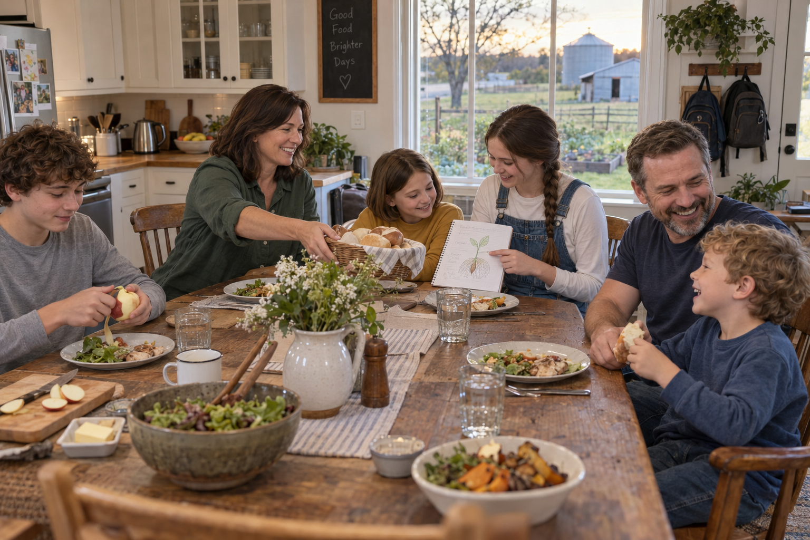

### 2. The Empty House

Another household starves after illness interrupts its ordinary exchanges. The family helps bury the dead and care for the survivors. They support a common granary so that need will be recognized sooner.

**Visual:** The parents and oldest children quietly help a bereaved neighbor at her kitchen doorway. Their younger children wait together nearby. The death stays outside the frame.

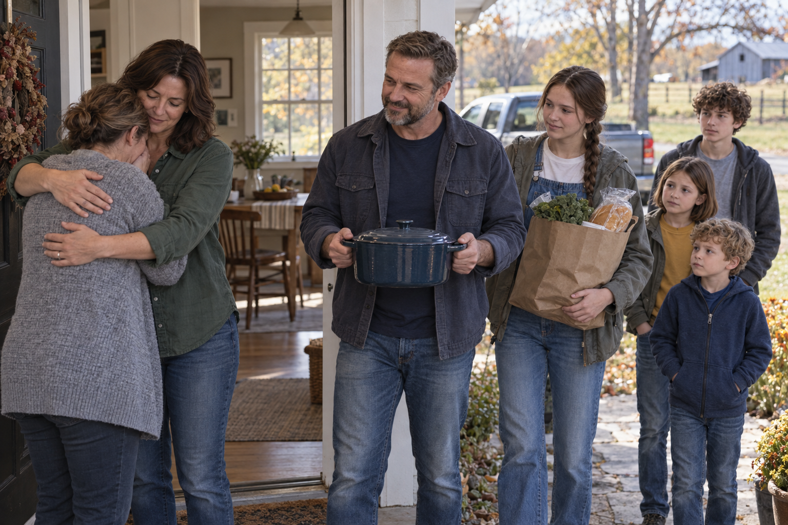

### 3. The Promise

The family contributes food, labor, and knowledge. The granary genuinely helps. A small group of highly educated, empathetic young women organizes meals and assistance. Their concern for hungry families earns trust.

**Visual:** The family and student-aged organizers work together at a cheerful food-distribution table inside the modern grain shed. This establishes the organizers' ordinary appearance and genuine warmth.

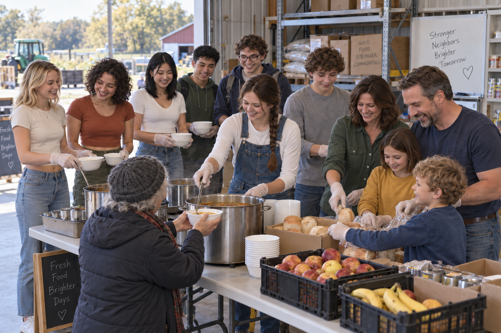

### 4. The Ledger

Contributions are recorded, then expected. The family's reliable harvests bring increasing demands. Separate entries for food and planting seed become a single total of available grain. The organizers ask why some households should decide what others may receive.

**Visual:** The mother and two young organizers compare household records and a tablet at a folding table beside carefully stacked seed sacks.

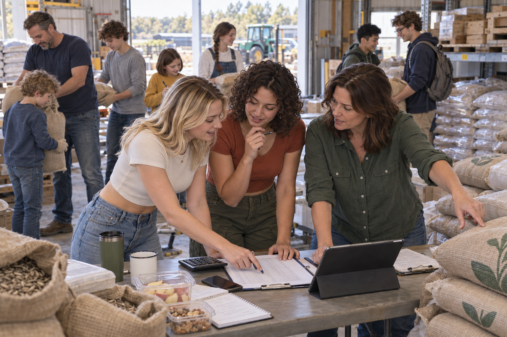

### 5. The Common Measure

Gifts become quotas. Exchanges between neighbors require approval. Decisions about next season's fields move away from the households working them. The older children's lessons attract objections when pupils question how planting reserves are counted.

**Visual:** A practical planting lesson is interrupted by an organizer holding a new form. The young teacher remains calm while learners look between the notebook and the form.

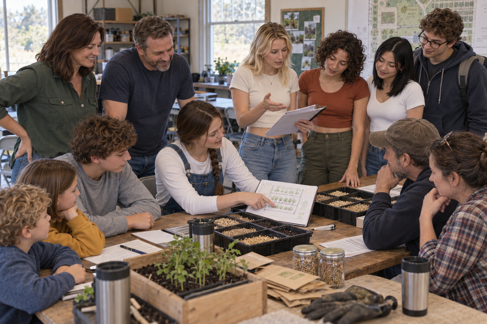

### 6. The Appeal

The parents challenge the demands while continuing to help. Their accounts are heard, but no binding protection follows. New council members retain the same powers. The organizers increasingly treat the family's insistence on deciding for itself as an obstacle to feeding others.

**Visual:** The parents present their seed calculations at an ordinary community meeting. The young organizers listen and respond from the same crowded table.

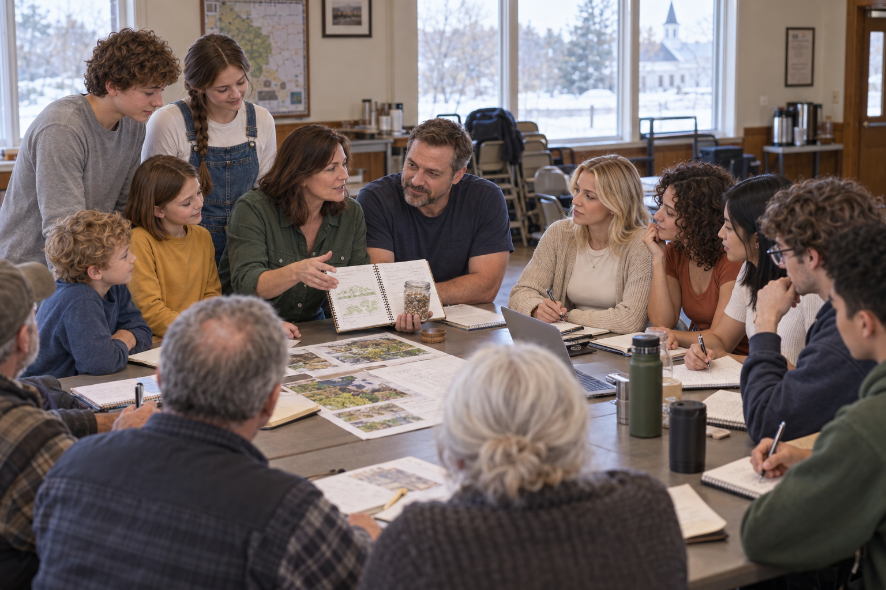

### 7. The Long Winter

Supplies diminish throughout the region. The family shares remaining food, reduces its own meals, and searches for alternatives. The older children demonstrate what will happen if the seed is eaten. The organizers return to the hungry children waiting outside.

**Visual:** The family gives away a small meal while an older child explains the last planting reserve. An organizer listens but watches the waiting families.

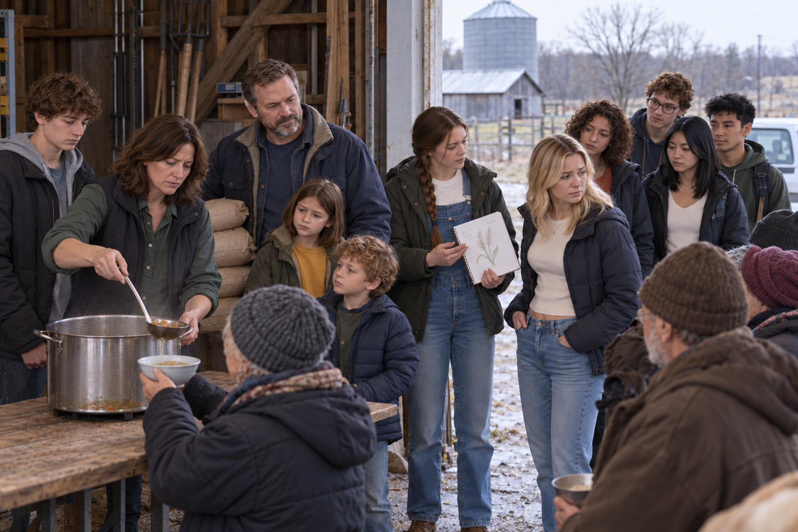

### 8. The Vote

The family argues for preserving enough seed to plant, acknowledging the immediate suffering this entails. The organizers demand its release while replacements are sought. A majority orders surrender. The family refuses to give up the next harvest.

**Visual:** Neighbors raise their hands in a village hall. The family stays together, hands lowered, beside their notebook and a jar of seed; the young organizer addresses the room.

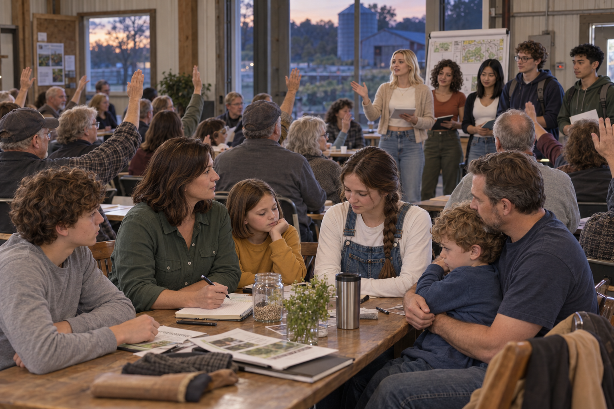

### 9. The Taking

The young organizers lead neighbors to the farm. Accusations become physical restraint and injury. The mob takes the last seed, then deliberately burns the house and barns. The parents and older children get every child out. They flee with only their lives. The seed is milled and eaten.

**Visual:** The whole family escapes on foot from the burning farm while the same young organizers and neighbors remove the last sacks of seed. The family carries no belongings.

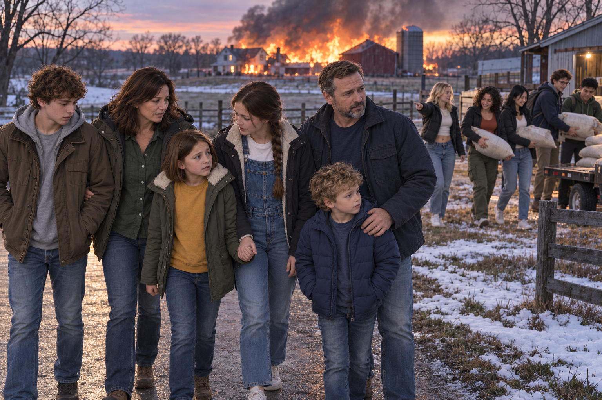

### 10. The Spring

The fields are fertile, but nothing is planted. No replacement seed arrives. The brief relief ends. As the season advances, the organizers and the same neighbors who burned the farm starve alongside the other townspeople.

**Visual:** The same organizers sit exhausted at an empty food-distribution table beside the burned farm and unplanted fields. Spring is green at the margins, but the fields remain bare. The final deaths stay outside the frame.

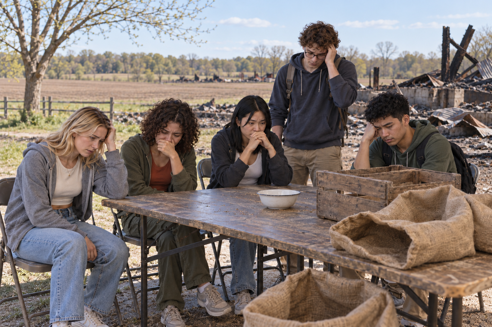

### 11. Nobody Left

Every resident who remained in the settlement dies. Elsewhere, the displaced parents and all their children survive together, without possessions or a restored farm. Their warning proved correct, but correctness returns nothing. They still have one another.

**Visual:** The family rests together beside a distant road, empty-handed. Their love remains visible, but there is no new home, restored farm, or triumphant expression.

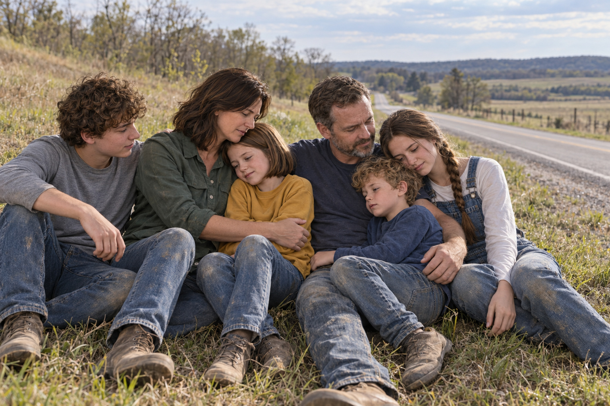

## Generation record

The built-in image generation tool was used. Full prompts and reference-image roles are recorded in [image-prompts.md](image-prompts.md). Images are planning references and remain outside the published blog and X queue.
