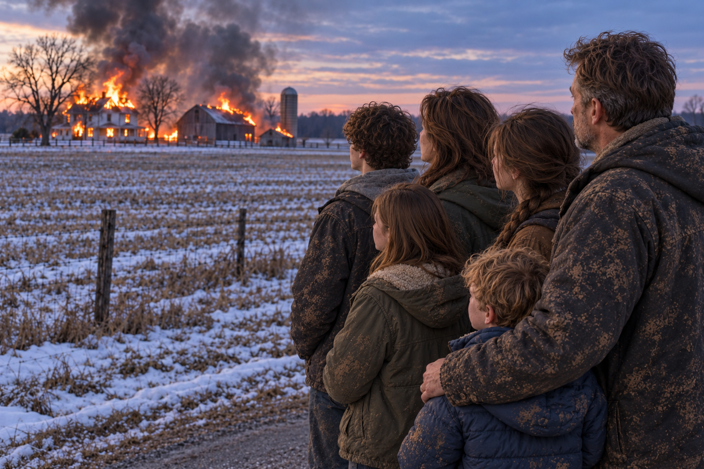
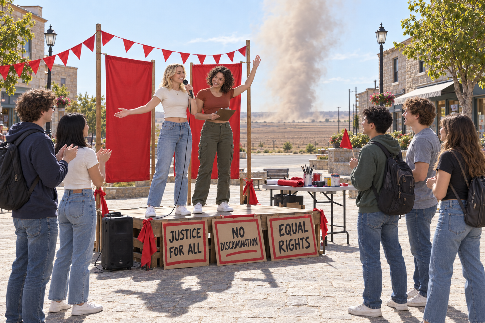
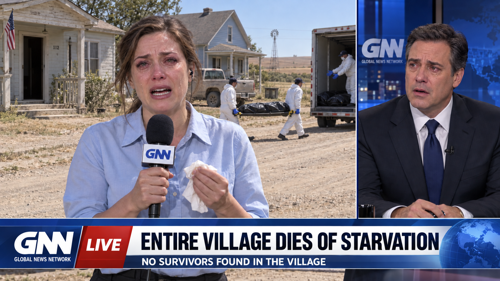

# The Common Granary — visual planning outline

Planning record, not queued or published content. The written English draft lives in [_posts/2026/2026-10-06-the-common-granary.markdown](../../_posts/2026/2026-10-06-the-common-granary.markdown). Companion to [GitHub issue #41](https://github.com/snscaimito/snscaimito.github.com/issues/41). Updated October 9, 2026.

## Story premise

In a future farming town, a loving family with several children prospers through hard work, knowledge, and preparation. They help freely, teach generously, respect other people's choices, and expect to be left alone. The granary begins as genuine voluntary assistance. Rules and demands gradually change who can decide over the family's work and planting seed. A small group of highly educated, empathetic young adults leads the drive to take the seed, and eventually the mob that burns the farm. The family escapes with only their lives. Nothing is planted in spring, every remaining town resident dies, and the displaced family alone survives from that community.

The same organizers change through the beliefs they adopt and reinforce in one another. They come to believe that need gives them authority over other people's work, that independent decisions obstruct fairness, and that resistance proves a lack of compassion. The family's voluntary help becomes an obligation, its preparation becomes hoarding, its teaching becomes obstruction, and its independence becomes cruelty in their eyes. Each coercive step feels to them like a further act of care. Their anger at the farm grows from this conviction: they believe they are protecting the hungry by forcing the family to surrender. Their familiar faces, concern for children, and sense of doing good persist throughout the transformation.

The emotional center is sincere care becoming selective and destructive. The organizers are victims as well as perpetrators: the meals they serve help real people, they deliberately hurt the family, and they eventually suffer and die under the conditions they helped create. Their final scene retains their tenderness toward one another. The family's protection of seed also expresses care for those same hungry children, extending beyond the current meal.

The village is remote, three hours from the highway. The organizers seize a carrier's cargo and publicly threaten and accuse suppliers and other outsiders. Carriers withdraw; distant officials and media dismiss or stop noticing its appeals. The family tries to alert the district from its refuge, but its warnings are filed with earlier complaints. No relief reaches the village. Every resident who remains literally dies of starvation, including the organizers, their victims, opponents, and children. A news crew arrives during the recovery, after all deaths.

## Writing and review

- Write the English narrative directly in the unpublished blog article, which is the canonical source for later X posts. Do not queue installments until requested.
- Use flowing prose and manageable paragraphs for people reading on phones. Vary sentence length and weave selected dialogue into action and observation; avoid long runs of isolated, short exchanges.
- Keep each scene under two minutes at an editorial baseline of 200 words per minute. Limit the narrative plus the separate X footer to 350 words, leaving room for the blog heading and image caption. Check the count for every scene before recording it in the article.
- The English article contains 14 main scenes and a news-crew epilogue, with 15 images. The Taking and its escape image have separate scene boundaries; the driving, rally, and shared-home images likewise have separate scenes. These expand the original 11-chapter outline without changing its plot order. The fictional narrative ends on the GNN broadcast image. The brief Activity Theory afterword follows at the very end, in a separate shaded panel with a divider and distinct typography.
- Build emotion through remembered hospitality, individual children, touch, interrupted teaching, and the loss of familiar household details. Preserve flowing paragraphs and restrained dialogue. The same organizers must remain recognizable in their affection, cruelty, and final suffering; do not replace their sincere concern with secret malice or erase their responsibility.

## Visual continuity

- Photorealistic people, places, and everyday objects with the appearance of rural Midwestern US life in 2026. The story remains a potential future, without historical or futuristic costumes.
- The Miller family has two parents and four children: Sarah (41), Dan (43), Emma (19), Luke (16), Abby (10), and Ben (7). These names and visual ages remain consistent throughout the scenes. All six survive and remain together.
- Sarah’s sister Rachel lives at the reservoir house outside the settlement. Mr. Peterson is the neighbor whose tire Luke helps patch in the opening scene.
- The organizers are predominantly highly educated women in their early twenties, accompanied by ordinary student-aged men. The women wear low-rise trousers and cropped casual tops with exposed midriffs; the men wear ordinary student clothes. Weather-appropriate layers are added in cold scenes.
- The five organizers are Madison Reed (blonde, policy studies), Hannah Brooks (dark curly bob, education), Olivia Hayes (straight black shoulder-length hair, public health), Ethan Parker (brown curls and glasses, records and delivery figures), and Jacob Morris (short dark hair, practical repairs). Their names recur from voluntary meals through seizure and the shared-home scene.
- Early scenes have no ideological signs, uniforms, badges, or villain styling. Education and good intentions appear through ordinary work, notebooks, conversation, and help. The town-square image includes readable placards saying “JUSTICE FOR ALL,” “NO DISCRIMINATION,” and “EQUAL RIGHTS.” Clothing and faces remain contemporary and ordinary throughout.
- The farmhouse, modern grain shed, village hall, seed sacks, faces, and base wardrobes recur. New scenes use the opening family image and the volunteer scene as visual references.
- The five volunteers remain individually recognizable from the soup table to the shed entrance. Warm cooperation gradually gives way to insistence, moral certainty, and anger. Their change appears in how they address the same family and use the same hands, notebooks, and doorway.
- The mob's anger appears through familiar faces, demanding gestures, and its advance through the grain-shed entrance. An additional image shows the tearful family watching the distant farm burn after escaping. Physical violence remains outside the images. By early summer, the same five organizers appear in their shared home with extremely thin bodies, visible ribs and collarbones, and loose clothing.
- No political labels appear in the eventual narration or dialogue. Theoretical and historical background remains in the GitHub research record. A brief separate Activity Theory afterword may describe the tools, rules, and roles without political labels.

## Scenes

### 1. The House

Establish the family's affectionate everyday life: meals, jokes, shared work, and older children teaching younger siblings and neighbors. Their planting seed is carefully stored for the next season. Generosity accompanies their independence.

**Visual:** A relaxed family supper in the farmhouse kitchen. The oldest daughter explains a small practical drawing to her younger sister while the parents laugh and pass bread. All six family members are present.

### 2. The Empty House

Another household starves after illness interrupts its ordinary exchanges. The family helps bury the dead and care for the survivors. They support a common granary so that need will be recognized sooner.

**Visual:** The parents and oldest children quietly help a bereaved neighbor at her kitchen doorway. Their younger children wait together nearby. The death stays outside the frame.

### 3. The Promise

The family contributes food, labor, and knowledge. The granary genuinely helps. A small group of highly educated, empathetic young women organizes meals and assistance. The five young volunteers share a house in town. Their concern for hungry families earns trust. The future mob leaders warmly thank the parents and learn from the older children; they accept the family's help as freely given.

**Visual:** The family and student-aged organizers work together at a cheerful food-distribution table inside the modern grain shed. This establishes the organizers' ordinary appearance and genuine warmth.

### 4. The Ledger

Contributions are recorded, then expected. The family's reliable harvests bring increasing demands. Separate entries for food and planting seed become a single total of available grain. The organizer who once thanked the mother now counts her reserves as something others are owed. Her colleagues reinforce the belief that nobody should decide privately what a hungry neighbor may receive.

**Visual:** The mother and two young organizers compare household records and a tablet at a folding table beside carefully stacked seed sacks.

### 5. The Common Measure

Gifts become quotas. Exchanges between neighbors require approval. Decisions about next season's fields move away from the households working them. The organizers call uniform obligations fairer than voluntary gifts. When the older children's lessons lead pupils to question how planting reserves are counted, the same knowledge once welcomed as help is treated as undermining the common effort.

**Visual:** A practical planting lesson is interrupted by an organizer holding a new form. The young teacher remains calm while learners look between the notebook and the form.

### 6. The Appeal

The parents challenge the demands while continuing to help. Their accounts are heard, but no binding protection follows. New council members retain the same powers. The organizers increasingly treat the family's insistence on deciding for itself as an obstacle to feeding others. A familiar organizer answers their planting calculations by asking why they insist on a right to refuse. The dispute turns from what the grain can produce to whether the family should be allowed that choice.

**Visual:** The parents present their seed calculations at an ordinary community meeting. The young organizers listen and respond from the same crowded table.

### 7. The Long Winter

Supplies diminish throughout the region. The family shares remaining food, reduces its own meals, and searches for alternatives. The older children demonstrate what will happen if the seed is eaten. The organizers return to the hungry children waiting outside. Among themselves, they interpret preserving seed as choosing property over people. Their distress strengthens their certainty that compelling surrender is their duty.

**Visual:** The family gives away a small meal while an older child explains the last planting reserve. An organizer listens but watches the waiting families.

### 8. The Vote

The family argues for preserving enough seed to plant, acknowledging the immediate suffering this entails. The organizers demand its release while replacements are sought. A majority orders surrender. The family refuses to give up the next harvest. The organizers take the vote as authority to act and the refusal as proof that the family has placed itself against the hungry. Their earlier friendship no longer protects the parents from accusation.

**Visual:** Neighbors raise their hands in a village hall. The family stays together, hands lowered, beside their notebook and a jar of seed; the young organizer addresses the room.

### 9. The Taking

The same young organizers who served soup beside the family lead neighbors to the farm. They demand entry with the conviction that taking the grain is an act of rescue. Their anger focuses on the family's continued refusal to submit. Accusations become physical restraint and injury. The mob takes the last seed, then deliberately burns the house and barns. The parents and older children get every child out. They flee with only their lives. The seed is milled and eaten.

**Visual:** From inside the grain shed, the parents face the same young volunteers, now angry and leading townspeople through the entrance. The blonde organizer braces the door open and points insistently; her colleagues demand entry with tense faces and raised hands. Seed sacks remain beside the parents. The children, fire, and physical violence stay outside the frame.

**Additional visual — after the escape:** All six family members stand together beside a country road. The camera is behind and to their right, showing their backs and partial cheek profiles. Their heads, eyes, and shoulders turn into the scene toward the burning farmhouse and barns across the field. Their hair is disheveled; coats and jeans are dirty, rumpled, and frayed. The parents hold the younger children close; the older children stand beside them. Their hands are empty.

### 10. Early Summer

Spring passes without planting. No replacement seed arrives. Sun heats the bare fields and wind lifts dust from the soil. The brief relief ends. By early summer, the five young organizers are starving in the home they share, too weak to move. They and the same neighbors who burned the farm starve alongside the other townspeople.

**Earlier visual — driving:** The camera is outside the pickup's open driver window. The blonde woman sits closest to the camera, hands on the steering wheel and eyes toward the road. The curly-haired woman sits across the center console in the passenger seat, smiling toward her. Both wear seatbelts. Dry roadside fields are visible through the far window.

**Next visual — town square:** The same two women stand on a low wooden platform with broad smiles. The blonde woman speaks into a microphone with her other arm extended; the curly-haired woman raises one hand and holds a clipboard in the other. Five young adults face them, some clapping and one holding a red pennant. Plain red banners, triangular bunting, and ribbons surround the platform. Red-bordered placards read “JUSTICE FOR ALL,” “NO DISCRIMINATION,” and “EQUAL RIGHTS.” A loudspeaker and a folding table with paint supplies and rolled fabric stand beside them. Empty paving surrounds the small group. Beyond the square, bare fields stretch beneath a twisting column of tan dust.

**Later visual — shared home:** The same five young adults lie or recline on a sofa, an armchair, and a rug in their shared living room. Their cheeks are deeply sunken, collarbones and ribs prominent beneath their skin, and arms and wrists very thin. Their clothes hang loosely; their heads tilt and hands rest limp. A TV, iPad, refrigerator, oven, microwave, dishwasher, and washing machine are visible. Early-summer sunlight enters through the windows, with green leaves outside. The coffee table holds the iPad and remotes.

### 11. Nobody Left

Every resident who remained in the settlement dies. Elsewhere, the displaced parents and all their children survive together, without possessions or a restored farm. Their warning proved correct, but correctness returns nothing. They still have one another.

**Visual:** The family rests together beside a distant road, empty-handed. Their love remains visible, but there is no new home, restored farm, or triumphant expression.

### 12. Epilogue — The News Crew

A GNN crew arrives during recovery, after every remaining resident has died. The producer remembers muting the organizers' accusations and assuming somebody nearer was responding. The reporter finds a photograph of the organizers and family serving food together. During her live report, she struggles to continue while workers remove the dead behind her and the studio anchor gives her time.

**Visual:** A GNN broadcast frame shows a tearful reporter holding a microphone and tissue. Behind her, two workers in protective coveralls walk away from an empty house doorway toward an open truck, carrying a sealed black body bag on a stretcher. Both face the truck. A third worker reaches from inside the truck to receive the stretcher. A studio anchor appears in the adjacent panel. The headline reads “ENTIRE VILLAGE DIES OF STARVATION,” with “NO SURVIVORS FOUND IN THE VILLAGE” below it.

## Generation record

The built-in image generation tool was used. Full prompts and reference-image roles are recorded in [image-prompts.md](image-prompts.md). Images are included in the unpublished draft and remain excluded from the published website and outside the X queue.
